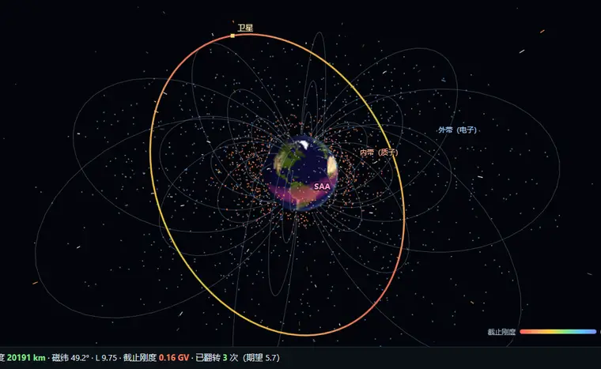
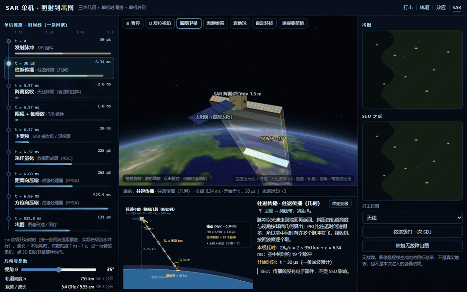
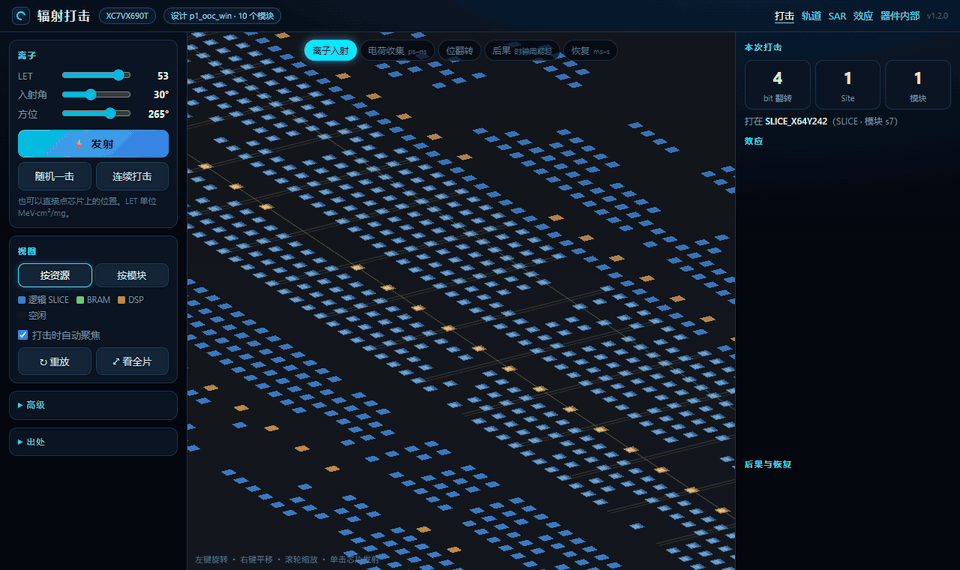
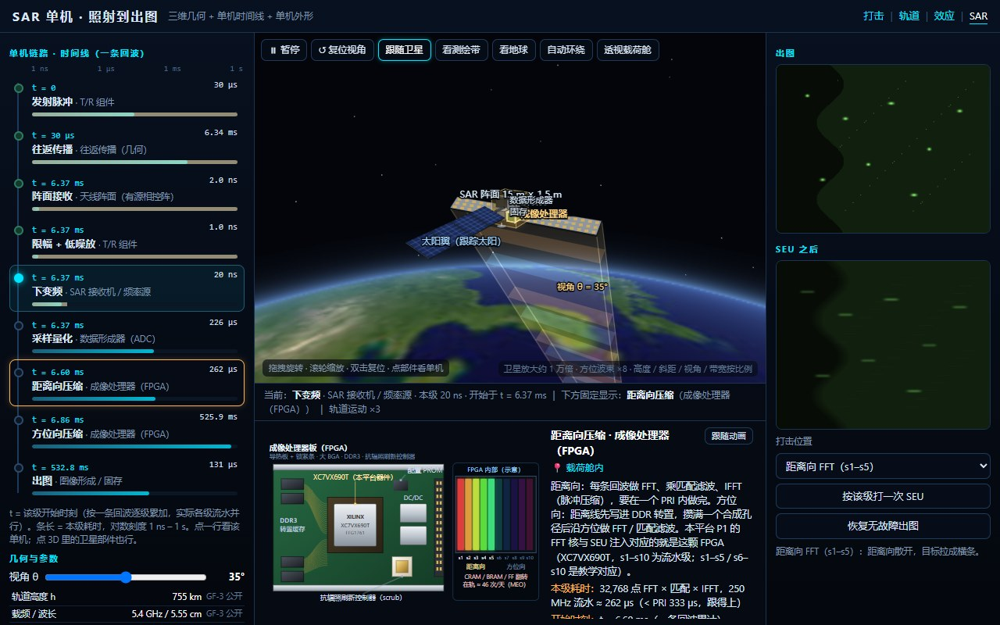
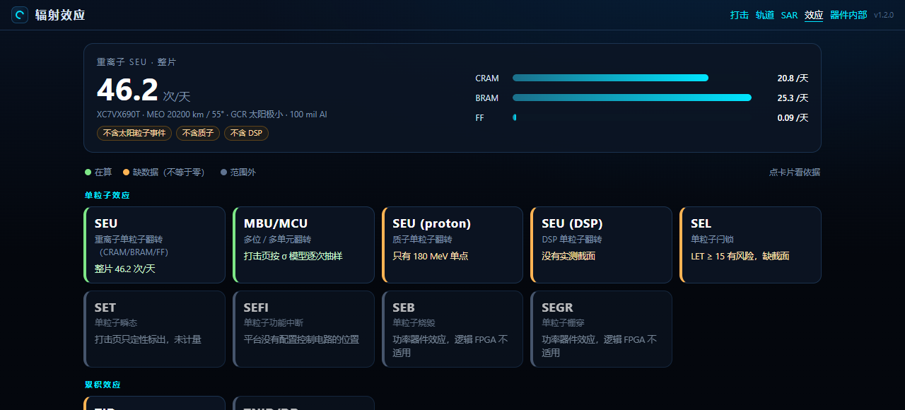
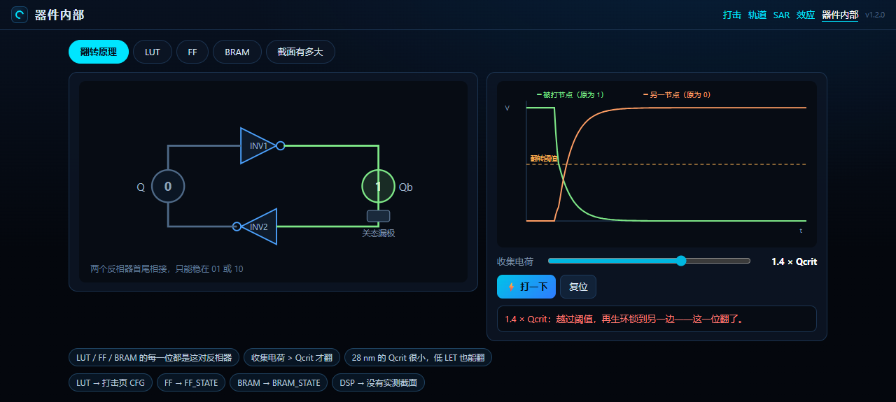

# seu_platform — what space radiation does to your FPGA design

[](https://github.com/juwadeLone/seu_platform/actions/workflows/ci.yml)
[](LICENSE)

<p align="center">
  
</p>
<p align="center"><sub>Live platform run · MEO 20200 km / 55° · inner-belt protons, outer-belt electrons, SAA, GCR, field lines · orbit colour = geomagnetic cutoff rigidity · satellite flashes sampled from the computed upset rate</sub></p>

**SPENVIS tells you what radiation is on your orbit. This platform tells you what that radiation does to your design.**

It goes from the orbit radiation environment (SPENVIS/CREME96 spectra, Bethe LET, 100 mil Al shielding) to per-bit upset rates (46.2 upsets/day for the whole chip in MEO; within 10% of the Lee et al. 2014 reference) to where a single ion lands on a real Vivado layout and what that does to an on-board SAR image.

Current device: Xilinx Virtex-7 **XC7VX690T** (28 nm). Example design: a 1024-point pipelined FFT Vivado layout, partitioned into modules by hierarchy — swappable for your own.

## One chain, five screens

| On-board SAR: strike to image | One ion on the real layout |
|---|---|
|  |  |
| 3D side-view geometry + unit timeline (6.3 ms round trip, 262 µs range compression…), each unit drawn to shape | incidence → charge collection → 4-bit MCU → consequences & SEL risk → scrub recovery; each strike classified SEU / MCU / SET / SEFI / SEL |

<p align="center"></p>
<p align="center"><sub>One SEU in the range FFT (s1–s5): top-right is the fault-free image, bottom-right after the flip — the point target smears along range</sub></p>

| Effects overview | Inside the device |
|---|---|
|  |  |
| Whole-chip 46.2 upsets/day plus CRAM / BRAM / FF breakdown; each effect marked computed / missing-data / out-of-scope | Why a cell flips: 1.4 × Qcrit collected charge crosses the threshold and the regenerative loop latches over |

## Quickstart

Python 3.10+, standard library only.

```bash
pip install .
seu-platform
```

That serves all five pages on a local port and opens your browser: `/` strike viewer · `/orbit` orbit dashboard · `/sar` SAR · `/effects` effects overview · `/seu` device internals. `seu-platform --server-only` skips opening the browser.

From a source checkout:

```bash
cd code/layout_ecc_sim
python -m unittest discover -s tests    # 117 tests
python -m layout_ecc.serve              # same server as the console script
```

`desktop/app.py` opens a native window instead when `pywebview` is installed (`pip install .[desktop]`).

## Current results

MEO 20200 km / 55°, GCR solar minimum, 100 mil Al shielding:

| Domain | per bit per day | whole chip per day | vs Lee 2014 Table 2 (GEO) |
|---|---:|---:|---:|
| CRAM (config memory) | 9.04×10⁻⁸ | 20.8 | 0.90 |
| BRAM | 4.67×10⁻⁷ | 25.3 | 0.90 |
| FF | 1.01×10⁻⁷ | 0.09 | 1.12 |
| **Whole chip** | | **46.2 /day** | one every ~31 min |

Cross-check: the same cross-sections under Lee et al.'s CREME96 GEO solar-minimum environment give 1.0 / 5.2 / 0.9 ×10⁻⁷; this platform's MEO numbers agree within 10% (MEO geomagnetic shielding is weaker — same order, slightly lower).

**Not included:** solar particle events, trapped protons, DSP. Missing data is labelled, not zero.

## Method and provenance

| Stage | Method | Source |
|---|---|---|
| GCR spectrum | CREME96 solar min, Z = 1–92, orbit geomagnetic shielding | SPENVIS 4.6 (20200 km / 55°) |
| Shielding | 100 mil Al spherical shell, continuous-slowing-down transport | CREME96 / Lee 2014 reference shield |
| LET | Bethe-Bloch + Barkas effective charge + Sternheimer density correction | 1.3% from NIST PSTAR; Fe peak 29 MeV·cm²/mg |
| σ(LET) | Weibull for CRAM / BRAM / FF domains | Lee, Wirthlin, Swift, Le, IEEE REDW 2014 Table 1 (A in cm²/bit) |
| Bit counts | CRAM 229,878,496 · BRAM 54,190,080 · FF 866,400 | AMD UG470 / DS180 / UG474 |
| Event rate | effective-LET thin-target R = (φ/2)·⟨σ(L/cosθ)⟩ | CREME86 tradition |
| Mission stats | Poisson: P(≥1) = 1 − e^(−RT) | |
| Cutoff rigidity | IGRF-13 2020 dipole Størmer | |
| Multi-bit share, SEL onset LET 15 | strike-page classification | Lee 2014 Table 3, §IV.C |

## Who it is for

- **FPGA engineers on on-board payloads** (SAR imaging, on-orbit AI, compute constellations): how often your design flips on this orbit, in which module, and what it does to the output — then decide where TMR / ECC / scrubbing goes.
- **Reliability and mission-modelling researchers**: fault rates and consequence parameters with physical provenance, instead of placeholder numbers.
- **Proposal / RHA-phase engineers**: order-of-magnitude estimates before beam time, with visuals a review board can follow.
- **Teaching**: radiation → device → circuit → image, in one chain.
- **Soft-error analysis for aviation, automotive, datacentre**: the flip → module → functional-consequence layer reuses; swap the front end for a neutron spectrum.

It does **not** replace beam testing or qualification. Proton-dominated LEO and solar particle events are currently gaps — see below.

## Not done yet

- Solar-particle-event worst cases (CREME96 worst week / day / 5 min)
- Trapped protons (AP8/AP9) and proton σ(E); DSP, SEFI, SEL cross-sections; total dose (SHIELDOSE)
- Full IRPP (currently the effective-LET approximation); shielding transport is an interim in-platform implementation — the standard flow is exporting a shielded LET spectrum from SPENVIS
- The bundled spectrum only covers 20200 km / 55°; other orbits must be re-run in SPENVIS (the platform rejects spectra that don't match the requested orbit)

See [ROADMAP.md](ROADMAP.md) for where this goes next.

## Layout

```
code/layout_ecc_sim/
  layout_ecc/          strike model, effect classification, layout import, web server
  layout_ecc/webapp/   the five pages
  layout_ecc/data/     layout, cross-sections, bit counts, effect tables — evidence files
  desktop/             native-window entry (pywebview)
  tests/               unit tests
code/orbit_seu/        orbit-environment engine (vendored, see code/orbit_seu/README.md)
experiments/fault_injection_1024/   frozen bit-level fault-injection experiment for a 1024-pt FFT
docs/media/            real-run captures in this README (headless-browser frames)
```

## Version

**v1.2.0 (2026-09)**: corrected whole-chip upset count (0.1007 → 46.2/day: five fixes — Lee 2014 header units, LET conversion, shielding, angular normalisation, ion species); rebuilt all five pages.

Earth texture: NASA Blue Marble (public domain). Cited papers and vendor documents are not distributed with the repository.

---

<details>
<summary><b>中文说明（完整版）</b></summary>

从**轨道辐射环境**算到**芯片每天翻几位**，再看**一颗离子打中之后**，芯片、模块和 SAR 出图各发生了什么。环境谱、截面、位数都来自标准模型或实测数据；没有数据的效应标成「缺数据」，不编数字。

当前器件：Xilinx Virtex-7 **XC7VX690T**（28 nm）。示例设计：一个 1024 点流水线 FFT 的 Vivado 布局。平台按层次名自动划分模块，换成别的设计同样适用。

**定位**：SPENVIS 告诉你轨道上有什么辐射；这个平台告诉你辐射把你的设计打成什么样——是它的下游，不是替代。

### 运行

Python 3.10+，只用标准库：

```bash
pip install .
seu-platform
```

五个页面全在本地端口上：`/` 打击 · `/orbit` 轨道 · `/sar` SAR · `/effects` 效应 · `/seu` 器件内部。装 `pywebview` 后可用 `code/layout_ecc_sim/desktop/app.py` 打开原生窗口。

### 结果与依据

见上方英文版表格（数字一致）。交叉验证：同一组截面在 Lee 等人用 CREME96 算的 GEO 太阳极小环境下给出 1.0 / 5.2 / 0.9 ×10⁻⁷，本平台 MEO 结果与之相差 10% 以内。

**不含**：太阳粒子事件、束缚质子、DSP。这些缺数据，不等于零。

### 对谁有用

做在轨处理载荷的 FPGA 工程师（SAR 成像、在轨 AI、计算星座）：看自己的设计在这条轨道上每天翻几次、落在哪个模块、对出图有什么影响，据此决定哪一级加 TMR / ECC、刷新多快。可靠性与任务建模研究者拿有物理出处的参数。方案论证、抗辐射保证阶段先用它估量级。教学科普一条链看完。航空、汽车、数据中心的软错误分析可复用「翻转 → 模块 → 功能后果」层。

它**不能替代**束流试验和鉴定。低轨质子场景与太阳粒子事件目前缺数据。

</details>
