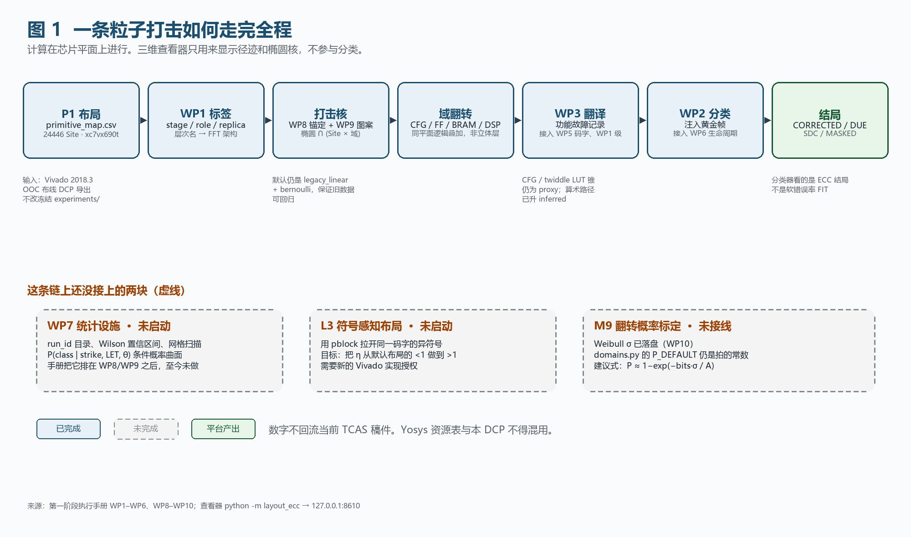
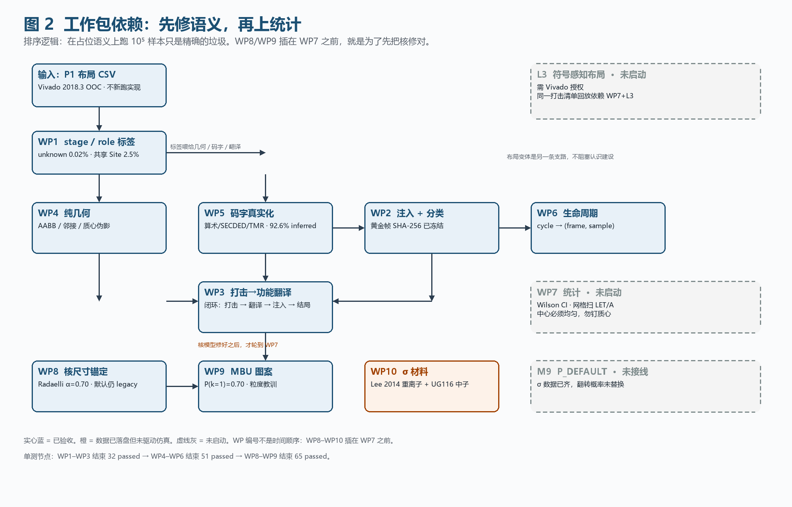
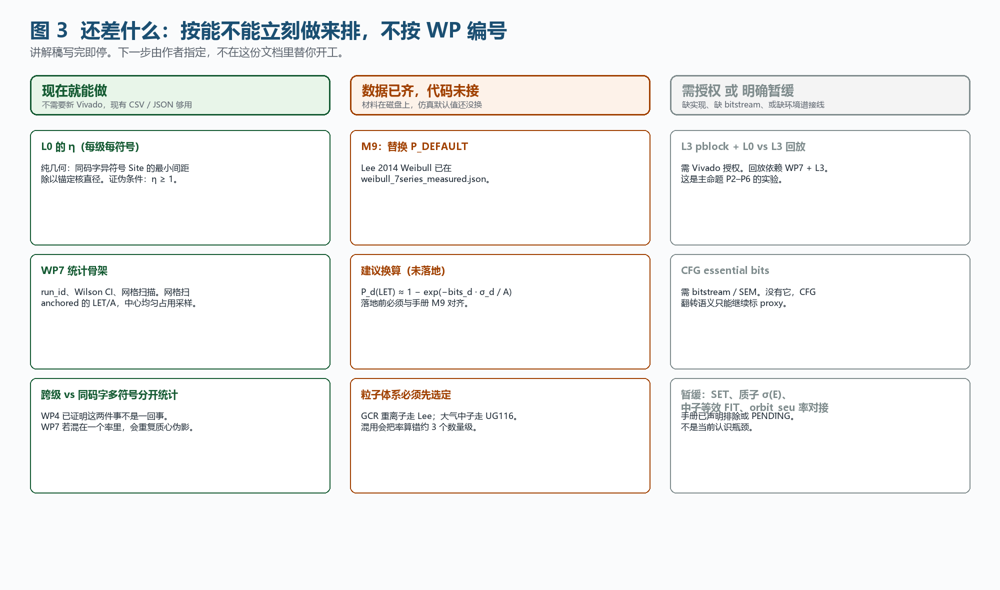

**这份文档做什么。** 把已经做完的工作包讲清楚，画出一条粒子打击如何走完全程，并标明还缺什么。读完之后你自己指定下一步。数字全部来自已落盘的执行记录，不编新实验，不回流当前 TCAS 稿件。

**对应材料。** 执行记录见同目录上一级的 `第一阶段执行手册.md`；论点骨架见 `理论凝练.md`（DRAFT）。本讲解是二者的导读，不替代手册里的验收清单。

# 1 平台是干什么的

写算法防护论文时，必须对软错误的物理行为做假设：哪些地方已经防护好了、哪些地方值得防护、一次打击最多影响几个单元。不了解这个过程，假设就是猜测——有时猜对，有时猜错，而作者自己不知道哪些是对哪些是错。

这个平台的目的不是产出更多数字，而是建立**假设判断力**：

- **哪些假设可以放心写**：简化不改变结论方向（例如数据通路上的累积效应可忽略——窗口太短）。
- **哪些假设必须加限定条件**：简化只在特定条件下成立（例如跨级故障独立恢复——均匀采样下可用，边界区域失效）。
- **哪些假设不能写**：简化与物理事实矛盾（例如默认布局下「每级最多一个错误」——需要布局干预才可能成立）。

一句话：**per-stage 算术 ECC 的纠错保证，在真实 FPGA 布局上到底成不成立。** 码给了「一次最多纠 1 个符号」的代数能力；布局决定一次粒子打击会不会同时打到同一码字的两个符号。

## 1.1 明确不是什么

| 它不是 | 原因 |
|---|---|
| 晶体管级 MCU 预测 | Site 坐标是布局代理，不是微米级敏感体积 |
| 当前 TCAS 稿件的数据源 | 本阶段与稿件完全脱钩；Yosys 资源表与本 DCP 不得混用 |
| `orbit_seu` 的环境谱积分 | 那是另一套工具（默认端口 8600）；本平台按网格扫 LET / 角度 |
| SET / 布线故障仿真 | 走线横跨多个 Tile，不属于 Site 级占用；手册明确排除 |
| 已标定的软错误率 | `domains.py` 的翻转概率仍是占位常数，等 M9 |

当前布局来自 P1 在 **xc7vx690tffg1761-2** 上、Vivado 2018.3 OOC 布线 DCP 导出的 `data/layout/p1_ooc_win/primitive_map.csv`（约 2.4 万 Site）。一格 = 一个占用 Site。RPM\_X / RPM\_Y 是架构单位，不是微米。

# 2 一条打击如何走完全程

计算在芯片平面上进行。三维查看器只用来显示离子径迹（$\theta$、$\phi$）和落在硅面上的椭圆核；左侧勾选框按域过滤显示，计算始终覆盖全部域。查看器：`python -m layout_ecc` → `http://127.0.0.1:8610/`。

{width=100%}

**故障域**不是垂直堆叠的物理层。一个 Site 在同一个 $(x,y)$ 上叠加四个逻辑域：配置位 CRAM（CFG）、用户 FF 状态、BRAM 数据、DSP 流水/输出状态。同一次椭圆对每个域分别求交、分别翻转，因此「同一打击同时翻配置位和 FF」这种跨域相关被天然保留。SET / 布线故意不建模。

**分类器看的是 ECC 结局，不是 FIT。** 四种结局：

| 结局 | 含义 | 平台里怎么造出来过 |
|---|---|---|
| CORRECTED | 检出、定位、纠正，功能字回到黄金 | s1 单符号 1 bit，算术 [6,4,3] |
| DUE | 无法唯一纠正（检测到不可纠正） | s4 同码字两个符号 |
| SDC | 输出已经偏了且没有检测标志 | s10 关掉保护 |
| MASKED | 翻转未进入观测，或被 TMR 多数票吃掉 | s8 单副本；或 delay 覆盖发生在读取前 |

# 3 工作包按认识顺序

WP 编号不是时间顺序。第一阶段先做 WP1–WP3（看懂链路），第二阶段拔掉语义占位（WP4–WP6），第三阶段先修打击核（WP8–WP9）并补上 $\sigma$ 材料（WP10），**统计基础设施 WP7 一直排在后面、至今未启动**。排序逻辑只有一句：在占位语义上跑 $10^5$ 样本只是精确的垃圾。

{width=100%}

单测节点：WP1–WP3 结束 32 passed → WP4–WP6 结束 51 passed → WP8–WP9 结束 65 passed。

## 3.1 WP1 标签：层次名变成 FFT 架构

**要回答的问题。** 十级 FFT 在芯片上各占哪些 Site？每级内部 butterfly / delay / twiddle / control / replica 各占多少？有没有一个 Site 被多个级共用？

**做了什么。** `layout_ecc/stage_tags.py` 只认 P1 实际出现的层次名，解析不出的标 `unknown`，不许猜。草稿里那 5 个关键字只能盖住约六成，对着 RTL 把名字补全后，unknown role 从约 39% 降到 **22 / 140907 = 0.02%**（几乎全是 GND / VCC 和 6 个 `ml*` LUT）。全部原语都挂在 `u/sN/` 下，没有 toplevel 残留。共享 Site **605 / 24446（2.5%）**：相邻级逻辑被 Vivado 打进同一 SLICE，不是解析器读错。

嵌套优先级必须先想清楚：`complete_butterflies[3].pipe_rot.rotate` 的语义是「蝴蝶实例里的旋转」，标 **twiddle 而不是 butterfly**。

**看明白了什么。** 没有这层标签，后面所有「跨级 / 同码字」都无从谈起。难的不是 stage，是 role——Vivado 会把乘法打成没有模块名的 `ii_s*` / `rr_s*` LUT 锥。

**产物。** `layout_ecc/stage_tags.py`；`data/layout/p1_ooc_win/unknown_report.txt`；查看器按级 HSV 着色。

## 3.2 WP2 功能层：位翻转变成 ECC 结局

**要回答的问题。** 零故障输出是什么？翻一个 FF 位，偏差多大、哪一级最敏感？四种结局各长什么样？

**做了什么。** 复用冻结的 P1 位级注入器（`experiments/fault_injection_1024`），**零修改**原文件。黄金帧 `data/golden/p1_random_seeded.json`，种子 20260721，SHA-256 记在同目录 `SHA256.txt`。零故障必须 100% 通过。wrapper 是 `layout_ecc/functional.py`。

LSB（bit 0）几乎被后续 `>>>1` 量化掉，看不出哪一级敏感。改用 **bit 20、protection=off** 开环续跑，偏差随级号倍增，末级最大（s1=2048 … s10=1048576），与「后面级剩余缩放更少」一致。

**看明白了什么。** 编码条件的边界可以在功能层单独验：纠 1 不纠 2。阈值 2 vs 3 的认识线不能拿 LSB 扫级表当结论。

**产物。** `data/golden/`；`data/wp2_stage_scan.json`；`data/wp2_rtl_check.json`。

## 3.3 WP3 翻译器：椭圆打击变成功能故障

**要回答的问题。** 一次椭圆翻的 (Site × 域)，翻译之后是同级还是跨级？跨级率随核半径 $a_0$、角度 $\theta$ 怎么变？

**做了什么。** `layout_ecc/functional_mapper.py` 把 `run_strike` 的翻转列表译成故障记录，再最多抽 8 条送给 WP2。第一版码字/符号仍是占位（`grid_x % 4`，`confidence: proxy`），后面由 WP5 替换。手扫把打击中心钉在占用包围盒质心 $(x_0 \approx 201.6,\, y_0 \approx 305.1)$，$a_0 \in \{4,8,12,16,20\}$，$\theta \in \{0^\circ,45^\circ,60^\circ\}$，每格 20 seed。

**当时看到的形状。** $\theta=0^\circ$ 时 $a_0=4$ 跨级率 0.55，$a_0 \ge 8$ 为 1.0；$\theta=45^\circ$ 时 0.95 → 1.0，单调不减。这**不是**统计结论，只确认趋势。真正的解释要等 WP4。

**产物。** `data/wp3_cross_stage_scan.json`。

## 3.4 WP4 几何：跨级是几何决定的，不用注入也能预测

**要回答的问题。** 每一级在芯片上的「带」有多厚？哪些级互为邻居？给定 $(a_0,\theta)$，期望跨几级？

**做了什么。** `layout_ecc/geom_metrics.py` 只看 Site 占用栅格（RPM 格，不是微米）：逐级 AABB / 质心、四邻接、级间最小欧氏距离、椭圆覆盖的 stage 集合。

关键测量：

- 十级都不是细条。AABB 短边 91–176 格（最薄 s10=91，最厚 s7=176）。看起来盒很大，是因为每一级在占用盒里呈块状/交错，不是十根平行细带。
- 不同级的已用 Site **零条四邻接、零条对角邻接**。连续级最近已用 Site 一律相距 **2.0 RPM**。
- WP3 的质心落在 s5 与 s6 的 AABB 重叠区。所以「$a_0 \ge 8$ 必跨级」是 **打在两级交界**，不是核随便放都跨级。

几何预测（均匀占用中心，80 点）与 WP3 手扫对比：

| $a_0$ | $\theta$ | WP3 翻转跨级率（质心） | 几何均匀跨级率 | 质心覆盖级数 |
|---|---|---|---|---|
| 4 | $0^\circ$ | 0.55 | 0.21 | 2 |
| 4 | $45^\circ$ | 0.95 | 0.25 | 2 |
| 8 | $0^\circ$ | 1.00 | 0.38 | 2 |
| 8 | $45^\circ$ | 1.00 | 0.39 | 2 |
| 20 | $60^\circ$ | 1.00 | 0.86 | 2 |

**看明白了什么。** 跨级主要是几何问题。均匀中心在 $a_0=8$ 仍有约六成打在单级内部。后面若做统计，中心不能只钉质心。

**产物。** `data/wp4_geometry.json`；查看器可叠加级 AABB。

## 3.5 WP5 码字：把 `grid_x % 4` 拔掉

**要回答的问题。** 一个 [6,4,3] 算术码字在网表里叫什么名字？同一码字的两个符号怎样被识别？

**做了什么。** `layout_ecc/codeword_map.py` 按层次名显式映射：

| 层次名 | codeword\_id | symbol | scheme |
|---|---|---|---|
| `complete_butterflies[g]` / `hold_*[g]` / `app_*[g]` | `sN:arith` | $g$ | arithmetic\_643 |
| `u_apply` / `res*` / `sy*` | `sN:arith` | 整字 | arithmetic\_643 |
| s10 `qu*` / `ql*` 等 | `s10:arith:upper\|lower` | 0–5 | arithmetic\_643 |
| `mem0..3` | `sN:secded:memK` | 0 | memory\_secded70 |
| `replicas[k]` | `sN:tmr` | $k$ | tmr3 |
| CFG 域 | 无 | — | **proxy** |

P1 布局：24446 Site 中 **22632（92.6%）inferred**。方案拆分：算术 14742、SECDED 4225、TMR 3665。仍为 proxy 的 1814 Site 主要是压扁的 twiddle LUT 锥（没有符号下标）。CFG 没有 essential-bit 名，即使 Site 有算术码字，CFG 翻转仍标 proxy。

交叉验证：`s1:arith` 单符号 → CORRECTED；`s4:arith` 双符号 → DUE。与 WP2 已知结局一致。

**看明白了什么。** 「同一码字多符号」事件现在可以被识别和计数。定量曲面留给 WP7。CFG 和 twiddle LUT 锥是剩下的语义缺口。

**产物。** `data/wp5_codeword_report.json`。

## 3.6 WP6 时间：这个位翻转到被读之前会不会被覆盖

**要回答的问题。** 第 $k$ 级延迟线在周期 $t$、地址 $a$ 装的是哪帧哪个采样？MASKED 能不能从近似升级为解析规则？

**做了什么。** `layout_ecc/lifetime.py` 的 DEPTH 来自 P1 RTL：s1=128 … s7=2；s8/s9 无 SDF 深延迟（offset=1）；s10 两拍对齐（offset=2）。四通道 1024 点 = 256 beat × 4 lane。`map_cycle(stage, cycle, address, lane)` → `(frame, beat, sample)` 以及 `cycles_until_read` / `cycles_until_overwrite`。

**MASKED 解析规则：** delay 角色且覆盖发生在配对读取之前 → MASKED（不再走译码器）；否则 OBSERVED，再由 WP2 给出 CORRECTED / DUE / SDC / TMR-MASKED。标准 SDF「同址读后写」下两者相等，默认注入多半是 OBSERVED。规则本身已单测。未上 XSim。

**产物。** `data/wp6_lifetime.json`。

## 3.7 WP8 核尺寸：把拍脑袋的 $a_0$ 换成文献面积

**要回答的问题。** 1 个 RPM 格对应多少 µm？受影响面积 $A$ 随能量怎么长？同一 (LET, $\theta$) 下，legacy 线性核与 anchored 核差多少？

**做了什么。** `layout_ecc/units.py` 是唯一换算出口。所有 magic number 收回这里，每条带 `source:` 或 `assumption:`。

- **RPM → µm。** UG474 / DS180 没有 7 系列 RPM 步长。标 assumption：区间 4–16 µm，名义 **8 µm**（区间中点）。不是 xc7vx690t 实测。
- **Radaelli 四点**（经 Ebrahimi DAC'13 Table 1）：22 / 47 / 95 / 144 MeV → 1.178 / 1.902 / 2.903 / 4.613 µm²。对数最小二乘 $A = c E^{\alpha}$：**$\alpha = 0.7015$**（亚线性），RMSE = 0.227 µm²。
- **能量不是 LET。** 桥是显式假设：$A(\mathrm{LET}) = 2.903\,(\mathrm{LET}/15)^{\alpha}$ µm²。不声称 $15\,\mathrm{MeV\cdot cm}^2/\mathrm{mg} \equiv 95\,\mathrm{MeV}$ 中子。

`run_strike(..., kernel_model="anchored")` 由 $A$ 得正入射圆 $a=\sqrt{A/\pi}$，再除以 `RPM_TO_UM` 成格，$\theta$ 仍按 $1/\cos\theta$ 拉长。默认保持 `legacy_linear`，不覆盖 WP3 / WP4 旧 JSON。

手扫（均匀占用中心，20 seed，不钉质心）：

| LET | $A$（µm²） | legacy 覆盖 Site | anchored 覆盖 Site | 高估倍数 |
|---|---|---|---|---|
| 5 | 1.34 | 128 | 1.00 | 128× |
| 15 | 2.90 | 172 | 1.00 | 172× |
| 30 | 4.72 | 238 | 1.00 | 238× |

**看明白了什么。** SRAM 簇面积在 8 µm/格下半径 $< 1$ 格，anchored 几乎总是 1 个 Site。WP3 用 $a_0=4$–20 格的线性核，比文献 SRAM MBU 面积大约两个数量级。这是模型误差，不是统计涨落。端到端执行器在 anchored 模式下会出现 **0 个候选**（见 `data/free_anchored.json`）：物理核比一个占用格还小。网格扫描若要看见邻居 Site，必须显式放大核，并在产物里标 assumption。

**产物。** `data/wp8_kernel_compare.json`。

## 3.8 WP9 MBU 图案：采「图案」而不是逐位掷硬币

**要回答的问题。** 一次打击翻 $k$ 位的 $P(k)$ 长什么样？给定 $k$，在核内怎么选？多重数在四域间怎么分？

**做了什么。** `layout_ecc/mbu_patterns.py`：

- $P(k=1)=0.70$、$P(k=2)=0.30$。来源 Pérez-Celis & Wirthlin, IEEE TNS 2021（中子 MCU 占事件 30%）。该文没有 3/4 bit 拆分，MCU 一律记 $k=2$（聚类的下界）。
- 域间权重 `bit_weight = bits`，注释标 assumption。
- `flip_model="pattern"`：先采 $k$，再在核内候选 (Site × 域) 里按到中心距离升序取前 $k$ 个（cluster），对照均匀随机。

真 Radaelli 核只有 1 个 Site，$k=2$ 只会打到同一 Site 的两个域（同一 `symbol_id`），「同码字多符号」看不见。扫描因此另加 **$A=1300$ µm² 地板**（约 2.5 格半径），只为让邻居 Site 进核，并在 JSON 里标 assumption。这不是文献面积。

20 seed、同一批均匀中心、anchored + 地板：

| 模型 | 平均翻转条数 | 跨级率 | 同码字多符号率 |
|---|---|---|---|
| bernoulli（$P_{\mathrm{DEFAULT}}\approx 0.3$/域） | 3.50 | 0.05 | **0.10** |
| pattern cluster | 1.20 | 0.00 | 0.00 |
| pattern uniform | 1.20 | 0.00 | 0.00 |

**看明白了什么。** 文献叙事「伯努利低估多重数」说的是 **按 bit、$p$ 很小** 的 CRAM 注入。这里是 **按 Site × 域、$p \approx 0.3$**，一枚硬币就能翻掉核里好几行，比「70% 只翻 1 条」的图案表更密。同码字多符号在这 20 次里只出现在伯努利侧。WP7 若上图案模型，必须先把 $p$ 降到 bit 级，或接受 Site 级伯努利会高估多符号。

**产物。** `data/wp9_pattern_compare.json`。

## 3.9 WP10 $\sigma$ 材料：重离子实测 + 中子官方锚点

**要回答的问题。** 28 nm 7 系列 FPGA 的截面能不能从「合成占位」换成可溯源的测量？中子官方数据怎么当校验锚点、又怎样避免和重离子混用？

**做了什么。** 两条材料、两种粒子，**禁止混用**：

| 材料 | 粒子 | 文件 | 用途 |
|---|---|---|---|
| Lee et al. REDW 2014（DOI 10.1109/REDW.2014.7004595） | 重离子 $\sigma(\mathrm{LET})$，Weibull | `data/weibull_7series_measured.json` | MEO / 深空 GCR；M9 标定的候选输入 |
| AMD/Xilinx UG116 v10.20（2025-07-23） | 中子单能 $\sigma$/bit + FIT | `data/ug116_7series_neutron_seu.json` | **仅作量级校验锚点** |

Lee 2014 测的是 XC7K325T（Kintex-7，28 nm），按同族借用到 xc7vx690t。论文 Table 1 的 $A$ 是 µm²/bit，换算 $\sigma_{\mathrm{sat}}(\mathrm{cm}^2/\mathrm{bit}) = A \times 10^{-8}$：

| 域 | $L_{\mathrm{th}}$ | $W$ | $s$ | $\sigma_{\mathrm{sat}}$（cm²/bit） |
|---|---|---|---|---|
| CRAM | 0.4 | 338.5 | 0.852 | $3.34\times 10^{-12}$ |
| BRAM | 0.1 | 87.5 | 0.893 | $3.82\times 10^{-12}$ |
| FF | 1.1 | 271.3 | 1.090 | $1.47\times 10^{-11}$ |

UG116 Table 1/2，行「28 nm / Kintex 7 and Virtex 7」，LANSCE 中子：CRAM $5.69\times 10^{-15}$ cm²/bit，BRAM $5.57\times 10^{-15}$ cm²/bit。**不发布用户 FF 截面**。重离子 $\sigma_{\mathrm{sat}}$ 与中子单能截面差约 3 个数量级，属预期：前者是高 LET 饱和截面，后者是大气中子单能截面。禁止把中子数喂进重离子 Weibull 核。

中子等效 FIT 换算标 **PENDING**，未编造。`domains.py` 的 `P_DEFAULT` **没有改**——那是 M9，另一个任务。

**看明白了什么。** $\sigma$ 的粒子体系必须先定清。WP7 的 LET 档可以基于 Lee 2014 的实测 $\sigma(\mathrm{LET})$，不必只靠 WP8 的中子能量 → LET 桥。FF 域官方中子缺口要在论文里显式声明。

# 4 三处教训，避免以后再踩

这三件事已经用现有手扫看明白了。WP7 若忽略它们，会把精确的垃圾变成带置信区间的垃圾。

## 4.1 质心伪影

将打击中心固定在布局质心（或任何与边界相关的特征点）会系统性高估跨域故障率。WP3 的饱和是交界伪影；WP4 用均匀占用中心把跨级率从 1.0 拉到约 0.38（$a_0=8$ 正入射）。正确的采样分布必须显式声明，且应在占用区域内均匀采样。这条教训适用于所有基于椭圆核的布局仿真，不限于本平台。

## 4.2 文献核落到 FPGA Site 上几乎总是单格

Radaelli 的 µm² 是 SRAM 簇面积。7 系列一个 SLICE / BRAM Site 比这个簇大得多。anchored 模式下半径常小于 1 个 RPM 格，端到端执行器会出现 0 个候选。跨级 / 多符号要的是 **Site 间距**，不是簇面积本身。若为了看见邻居而放大核，必须在产物里写明这是 assumption，不能假装那是文献面积。

## 4.3 Site 级伯努利和 bit 级 MCU 图案不是同一稀疏度

$p \approx 0.3$ 按 (Site × 域) 掷硬币，比文献 $P(k=2)=0.30$ 的 bit 级图案更密，会**高估**同码字多符号。WP9 那张「伯努利 0.10、图案 0.00」的表，方向与「图案提高多符号」的论文叙事相反，原因就是粒度没对齐。要谈图案效应，先统一粒度。

# 5 主命题与 $\eta$

以下摘自 `理论凝练.md` §1，不在这里扩写成新论文。用途：下一篇论文的论点骨架。

对于采用 per-stage 符号级纠错码（如 [6,4,3] 算术码）的流水数据通路，单次粒子打击的可纠正性由两个独立条件的**合取**决定：

$$
\text{可纠正}
= \underbrace{\bigl(\text{翻转符号数} \le \lfloor(d_{\min}-1)/2\rfloor\bigr)}_{\text{编码条件（代数）}}
\;\wedge\;
\underbrace{\bigl(\text{被核覆盖的异符号数} \le 1\bigr)}_{\text{几何条件（物理）}}
$$

编码条件由码的最小距离保证，与布局无关。几何条件由布局决定，与码无关。**默认 FPGA 布局不保证几何条件成立。**

定义符号感知隔离比：

$$
\eta = \frac{d_{\min}(\text{同码字、异符号的 Site 集合})}{D_{\mathrm{kernel}}(\mathrm{LET},\,\theta)}
$$

其中 $D_{\mathrm{kernel}}$ 是打击核在斜入射角 $\theta$ 下的有效直径（含 $1/\cos\theta$ 拉伸）。

- $\eta > 1$：单次打击几何上不可能覆盖同一码字的两个符号 → 代数保证在空间相关故障下仍然成立。
- $\eta \le 1$：存在打击位置和角度的组合使两个符号同时被覆盖 → 可能出现 DUE。

非正式表述：纠错码的代数保证有一个隐含前提——同一码字的符号不能被一次打击同时摧毁。布局决定这个前提兑不兑现。

**已经有的证据（不是推测）。**

| # | 证据 | 来源 |
|---|---|---|
| E1 | 同码字单符号 → CORRECTED，同码字双符号 → DUE | WP2、WP5 |
| E2 | 默认 Vivado 布局下同一码字的符号在物理上聚拢 | WP1、WP5 |
| E3 | 伯努利模型下同码字多符号率 = 0.10（20 seed，带面积地板） | WP9 |
| E4 | 文献锚定核面积 1.2–4.6 µm²，远小于 WP3 占位的 $a_0=4$–20 格 | WP8 |
| E5 | 跨级率对打击中心采样分布敏感（质心 vs 均匀） | WP3、WP4 |

**还没算的关键量：** 默认布局 L0 的 $\eta$（每级每符号）。这是纯几何，现有 CSV 即可，证伪条件是 $\eta \ge 1$。L3 布局、同一打击清单回放、Wilson 区间对比，都排在它和 WP7 之后。

平台明确**不覆盖**的范围：CFG 布线 PIP、SET、累积多事件（两次独立打击是泊松卷积，不是布局问题）。CFG 的 LUT INIT 只是部分覆盖——间距隔离可以降低同码字多符号，但语义是结构改变。

已声明的 assumption：RPM → µm 名义 8 µm；中子能量 → LET 桥；椭圆核是 MBU 图案的粗粒度代理；域间翻转按位数加权。

# 6 还差什么

{width=100%}

按「现在就能做 → 数据已齐未接 → 需要授权或暂缓」三档。不替你开工。

**现在就能做。**

1. **计算 L0 的 $\eta$。** 对每一级、每一个算术码字，取同码字异符号 Site 集合的最小间距，除以锚定核直径。现有 `primitive_map.csv` + WP5 标签 + WP8 `units.py` 就够。若 L0 的 $\eta \ge 1$，主命题的「默认布局不满足几何条件」会被证伪，必须先停下来讨论。
2. **WP7 统计骨架。** `run_id` 目录（配置、种子、输入哈希、输出、日志，禁止覆盖）、Wilson 置信区间、按目标绝对误差预先计算样本量、网格扫描。网格必须扫 **anchored 的 LET 或 $A$ 档**，不要再扫裸 $a_0=4$–20。中心在占用内部均匀采样，不要钉质心。跨级与「同码字多符号」分开统计。
3. **查看器默认模型。** 现在 GUI 仍走 `legacy_linear` + `bernoulli`。这不是功能缺口，但是认知陷阱：屏幕上看到的核比文献核大两个数量级。

**数据已齐，代码未接。**

4. **M9：用 Weibull 替换 `P_DEFAULT`。** 交接文档给出建议式
   $P_d(\mathrm{LET}) \approx 1 - \exp\bigl(-\mathrm{bits}_d \cdot \sigma_d(\mathrm{LET}) / A_{\mathrm{kernel}}\bigr)$，
   尚未落地。落地前必须先选定粒子体系（GCR 重离子走 Lee 2014，地面/LEO 大气中子走 UG116），并与手册 M9 对齐。FF 没有厂商中子锚点，要在替换报告里显式留缺口。

**需要 Vivado 授权。**

5. **L3 符号感知 pblock。** 布局干预的目标是把 $\eta$ 从默认的 $<1$ 做到 $>1$，代价是布线资源和时序。没有 L3，主命题的 P2–P6（L3 改善、同一打击回放、核直径扫描、残余 DUE 来自非符号路径）都无法检验。
6. **同一打击清单回放（L0 vs L3）。** 依赖 WP7 + L3。这是「布局让代数保证兑现」最硬的实验。

**明确暂缓。**

7. CFG essential bits 真实化（需 bitstream / SEM）。
8. SET / 布线建模。
9. 质子 $\sigma(E)$ 表（交接 §2.2，DEFERRED）。
10. 中子等效 FIT 换算（PENDING）。
11. 累积层 / `orbit_seu` 率对接（等 WP7 出真统计）。

# 7 怎么本地跑

工作目录一律是 `code/layout_ecc_sim`。不要改 `manuscript/`，不要改冻结的 `experiments/fault_injection_1024` 结果。

```bash
python -m unittest discover -s tests
python -m layout_ecc                          # 查看器 http://127.0.0.1:8610/
python -m layout_ecc.stage_tags               # unknown 报告
python scripts/wp2_stage_scan.py
python scripts/wp3_handscan.py
python scripts/wp4_geometry_metrics.py
python scripts/wp5_codeword_report.py
python scripts/wp6_dump_lifetime.py
python scripts/wp8_kernel_compare.py
python scripts/wp9_pattern_compare.py
python scripts/run_free_executor.py --kernel legacy_linear
```

`orbit_seu` 默认在 8600，可以同时开。端到端执行器在 `--kernel anchored` 时，文献核常常小于一格，候选数为 0——这是 WP8 的预期行为，不是执行器坏了。需要网格空间扫描时用 `legacy_linear` 的 $a_0$，并在记录里写明这是网格代理而不是物理半径。

# 8 数字从哪来

本讲解不引入手册之外的新数字。主要落盘路径：

| 路径 | 对应 |
|---|---|
| `data/layout/p1_ooc_win/primitive_map.csv` | 唯一布局输入 |
| `data/golden/p1_random_seeded.json` | WP2 黄金帧 |
| `data/wp2_*.json` `data/wp3_*.json` | 扫级与跨级手扫 |
| `data/wp4_geometry.json` | 几何度量 |
| `data/wp5_codeword_report.json` | 码字覆盖 |
| `data/wp6_lifetime.json` | 生命周期 |
| `data/wp8_kernel_compare.json` | 核对比 |
| `data/wp9_pattern_compare.json` | 图案对比 |
| `data/weibull_7series_measured.json` | 重离子 Weibull |
| `data/ug116_7series_neutron_seu.json` | 中子校验锚点 |

README.md 里仍有一句「码字/符号规则目前是占位」。那是 WP5 之前的句子，以手册 §9.2 和本讲解 §3.5 为准：算术 / SECDED / TMR 路径已升 `inferred`，CFG 仍为 `proxy`。

---

读完之后指定下一块即可。建议优先问一句：L0 的 $\eta$ 到底是不是 $<1$。这个问题现有数据就能回答，而且直接决定主命题还站不站得住。
